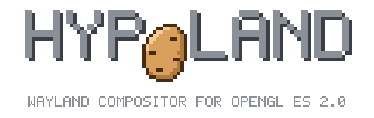
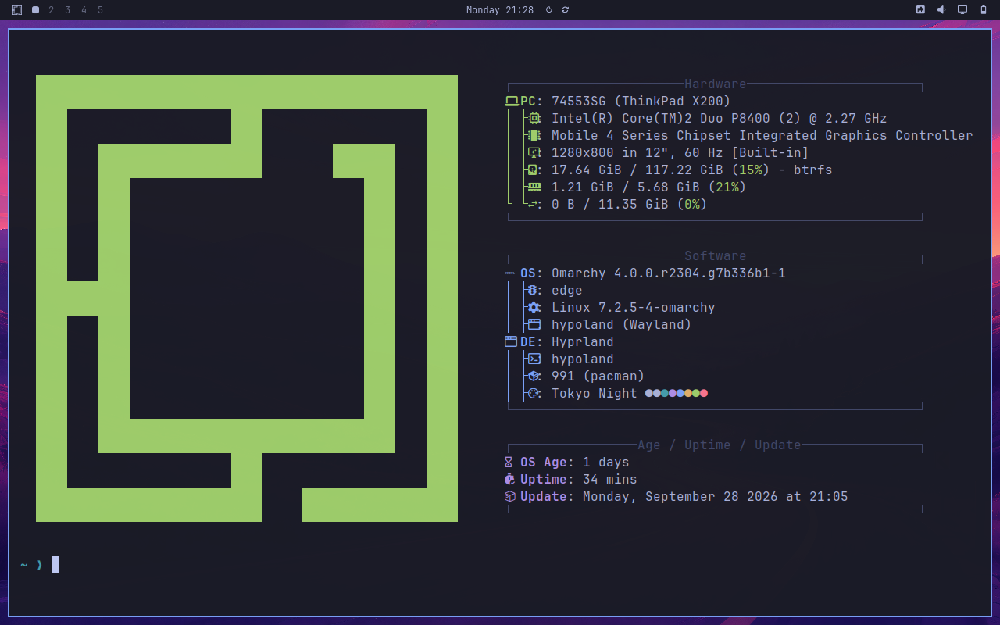
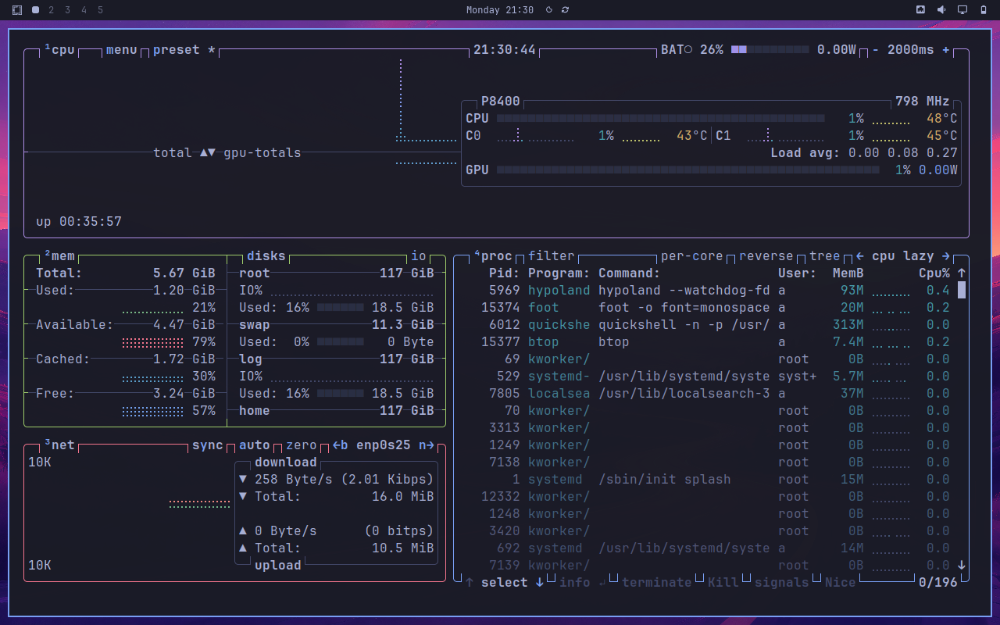

<div align="center">

</div>

# Hypoland

Hypoland is a fork of [Hyprland](https://github.com/hyprwm/Hyprland), the dynamic tiling Wayland compositor,
for old GPUs that only support **OpenGL ES 2.0 / OpenGL 2.1**.

Hyprland requires OpenGL ES 3.0 and does not start on such hardware. Hypoland targets Intel Gen4 / Gen4.5
graphics (GMA X3100 / 965GM, GMA 4500MHD / GM45) and is developed and tested on a ThinkPad X200.

Hypoland is an independent project. It is not affiliated with or endorsed by Hyprland or its developers.

## Screenshots

Omarchy 4 running on Hypoland on a ThinkPad X200 (Core 2 Duo P8400, GMA 4500MHD, 1280x800):

<p align="center">


</p>

## Differences from Hyprland

- The renderer runs on OpenGL ES 2.0, with shaders in GLSL ES 1.00.
- [aquamarine](https://github.com/hyprwm/aquamarine) is embedded (`subprojects/aquamarine`) and linked
  statically. Its DRM renderer uses OpenGL ES 2.0 only. The system aquamarine is not used.
- The binaries are named `hypoland` and `start-hypoland`, all commands are lower case. `start-hyprland` is
  installed as a symlink. There is no `Hyprland` or `hyprland` command, start the compositor with
  `start-hypoland` (or `hypoland`).
- Color management, HDR and motion blur are removed. Their config options stay registered and are ignored,
  so existing configs keep loading.
- The blur variants ripple, water, fluid_jar, prism and acrylic are removed, selecting one gives the normal
  dual Kawase blur.
- Screen shaders (`decoration:screen_shader`) must be written in GLSL ES 1.00. Shaders written for Hyprland
  are GLSL ES 3.00 and fail to compile.
- Plugins and hyprpm are not supported. Hyprland plugins are built against the exact Hyprland source they
  load into, and Hypoland's renderer is GLES2 only. `hl.plugin.load()` is ignored with a warning,
  `hyprctl plugin list` reports no plugins and `hyprctl plugin load` fails. No headers or `hyprland.pc`
  are installed.
- Xwayland starts when the first X11 program connects, not together with the compositor. `DISPLAY` is set from
  the start as before.
- The logo background and splash text are removed, `misc:disable_hyprland_logo` and
  `misc:disable_splash_rendering` are ignored.
- Hypoland does not start Hyprland's welcome app, update news or donation popup
  (`hyprland-welcome`, `hyprland-update-screen`, `hyprland-donate-screen`). `ecosystem:no_update_news` and
  `ecosystem:no_donation_nag` are ignored.

### Changed defaults

- Blur, shadows and animations are off.
- `cursor:enable_hyprcursor` is off, XCursor themes are used.
- `quirks:skip_non_kms_dmabuf_formats` is off. Gen4 display planes have no formats with alpha, so with the
  Hyprland default no client gets an EGL config with alpha and transparent surfaces turn black.

## Compatibility

Hypoland is meant to be a drop-in replacement, everything that talks to Hyprland keeps working:

- Config: `$XDG_CONFIG_HOME/hypr/hyprland.lua`
- IPC: `hyprctl`, the sockets in `$XDG_RUNTIME_DIR/hypr/$HYPRLAND_INSTANCE_SIGNATURE/`, command names,
  JSON output and event names
- `XDG_CURRENT_DESKTOP=Hyprland`
- The Hyprland Wayland protocols

Use the `hyprctl` built from this repository, so the versions match.

Source: <https://github.com/hegjon/hypoland>

## Building

Dependencies are the same as for Hyprland, except aquamarine (embedded), udis86 and glaze (not needed). See the
[Hyprland wiki](https://wiki.hypr.land/Getting-Started/Installation/).

```sh
cmake -S . -B build -DCMAKE_BUILD_TYPE=Release
cmake --build build -j$(nproc)
```

Build for baseline `x86-64` when the target machine is older than the build machine, do not use `-march=native`.

### Arch Linux package

`packaging/arch/PKGBUILD` builds a package from the working tree:

```sh
cd packaging/arch
makepkg -f
```

The package provides and conflicts with `hyprland`, so installing it replaces the system Hyprland.

## Credits

All credit for the compositor goes to [Hyprland](https://github.com/hyprwm/Hyprland) and its contributors.
Hyprland thanks wlroots, tinywl, Sway, Vivarium, dwl and Wayfire.

## License

BSD 3-Clause, the same as Hyprland. See [LICENSE](LICENSE).
